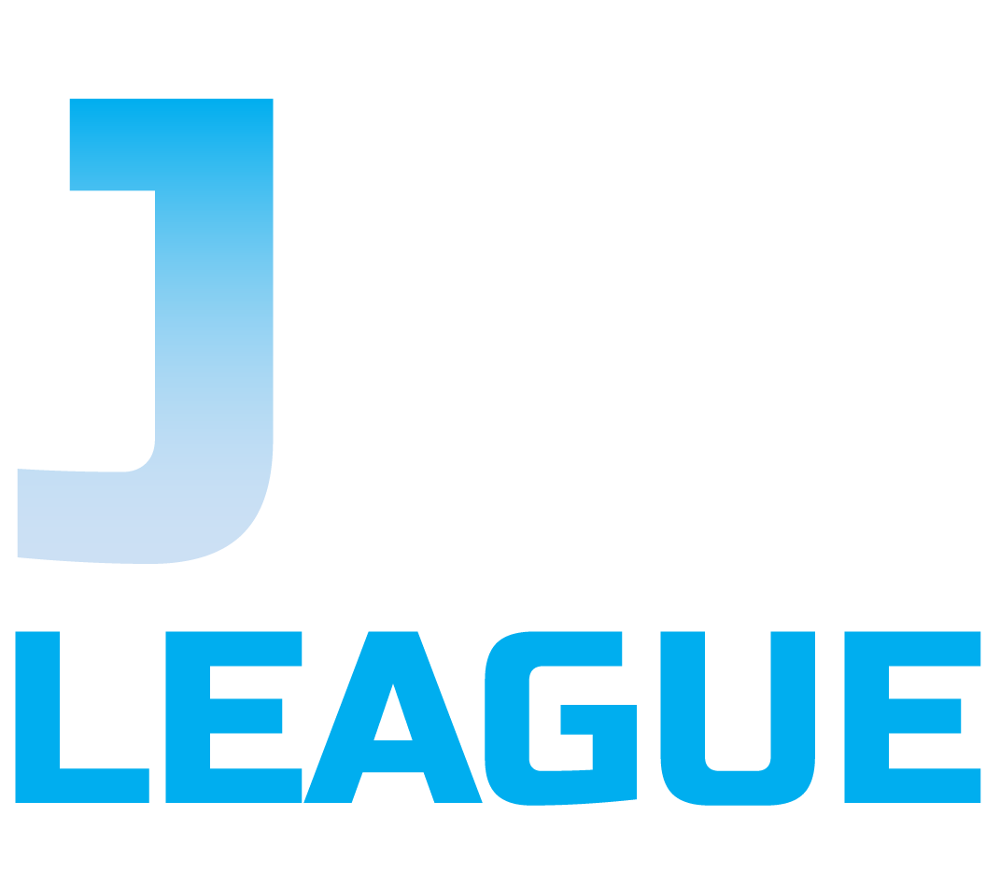
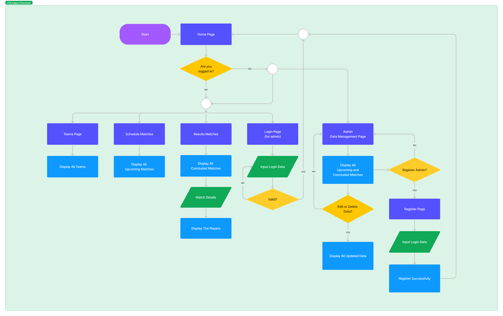
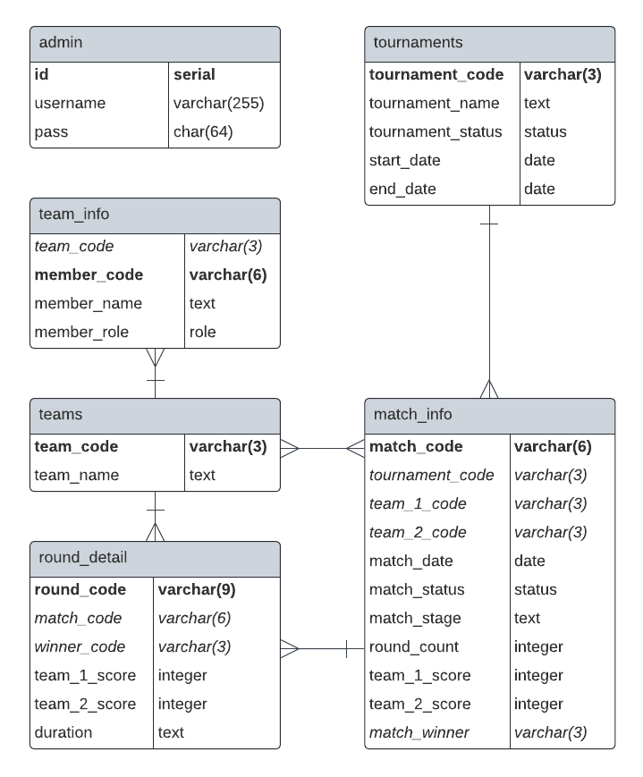
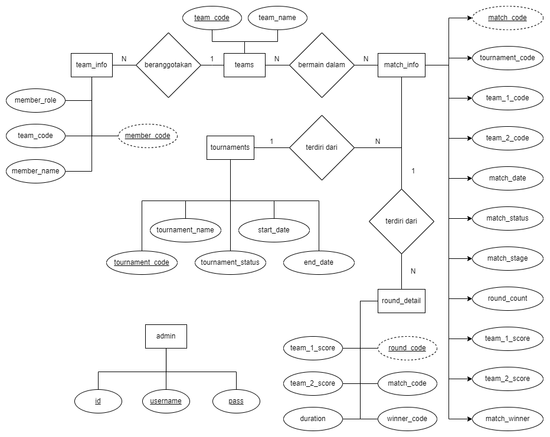

  
  <h1 align="center">Mobile Legends Tournament Monitoring Website 🎮</h1>

**Group J10**
+ [M Fathan Muhandis](https://github.com/fathanmuhandis) - 2106731623
+ [Arka Brian Dewara](https://github.com/arkadebrian) - 2106731421
+ [Jeffri](https://github.com/JeffriUI) - 2106705070

## Introduction
J10 League is a useful website for monitoring game tournaments, namely Mobile Legends. In it there will be a playing schedule of the teams that will compete, then there is a recap of the results of the matches of the teams that have competed which are filled with the results of the match winners, team profiles, their members, and so on. In addition, there will be a feature for admin logins so they can edit data on the website.

## Features

#### `Schedule Matches`

Enjoy personalized features by creating an account and logging in. TixOnline allows users to manage their profile, track booking history, and receive tailored recommendations. With secure authentication mechanisms in place, your personal information and account details are safe.

#### `Results Matches`

Discover an extensive collection of movies through TixOnline's intuitive interface. Explore detailed information about each movie, including plot summaries, genres, and ratings. Get a comprehensive overview and make informed choices about your movie selections.

#### `The Teams`

TixOnline simplifies the ticket booking process, allowing users to effortlessly select their preferred movie, showtime, and seats. With a streamlined interface, you can confidently proceed to book tickets securely. The application ensures that seats are not double-booked, providing a hassle-free experience.

#### `Data Management for Admin`

Easily access your past bookings with TixOnline's booking history feature. Stay organized by reviewing your previous movie choices, showtimes, and the seats you booked. Keep track of your cinema experiences and plan future outings with ease.

## Tables

The following are tables used in the TixOnline's database.

### 1. `admin`

This table stores information about administrators of the J10League application.

- id
- username
- pass

### 2. `teams`

This table stores information about all of the team from Indonesia.

- team_code
- team_name

### 3. `team_info`

This table stores information about team information in details.

- team_code
- member_code
- member_name
- member_role

### 4. `tournaments`

This table stores information about tournament information in details.

- tournament_code
- tournament_name
- tournament_status
- start_date
- end_date

### 5. `match_info`

This table stores information about the match schedules of the teams that will compete and their results.

- match_code varchar
- tournament_code
- team_1_code
- team_2_code
- match_date
- match_status
- match_stage
- round_count
- team_1_score
- team_2_score
- match_winner

### 6. `round_detail`

This table stores information regarding the details of the match results.

- round_code
- match_code
- winner_code
- team_1_score
- team_2_score
- duration

## Getting Started

To get started with TixOnline, follow these simple steps:

1. Clone the repository: `git clone https://github.com/SistemBasisData2023/J10League.git`
2. Install dependencies: `npm install`
3. Start the application: `npm start`
4. Visit `http://localhost:3001` in your browser to access J10League.

## Technologies Used

- Node.js 
- Express 
- PostgreSQL 
- HTML
- CSS
- Tailwind
- JavaScript
- Libraries: axios, bcrypt, body-parser, cors, express, jsonwebtoken, nodemon, pg.

<a href="https://nodejs.org" target="_blank" rel="noreferrer">        

## Flowchart

The flowchart provides a visual representation of the different stages involved in using J10League, such as Schedule Matches, Results Matches, The Teams, and Data Management for Admin. By following the flowchart, customers can seamlessly navigate through each stage and accomplish their desired tasks efficiently.

  
Click Here

  

## UML Diagram

  
Click Here

## Entity Relationship Diagram

  
Click Here

